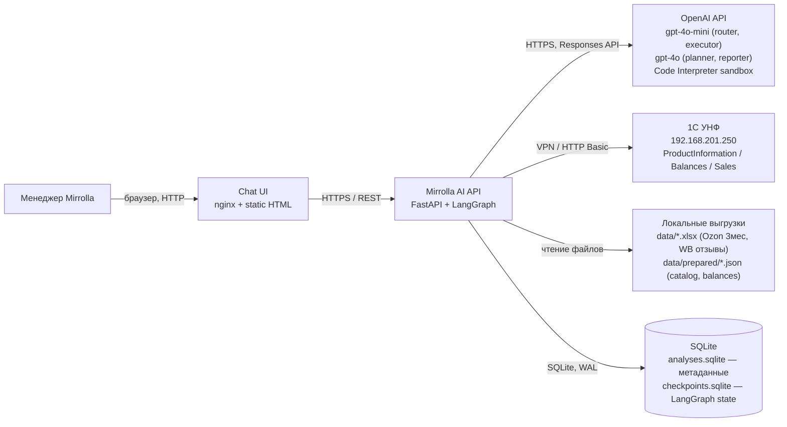
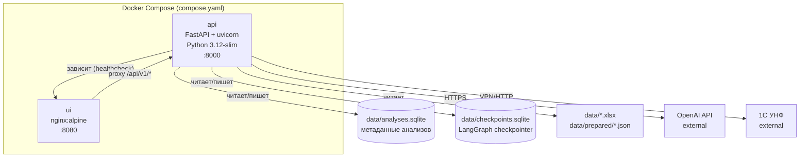
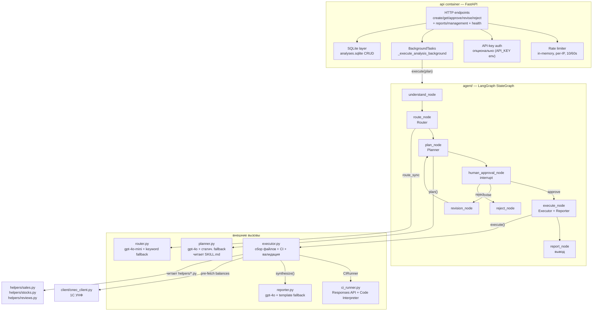
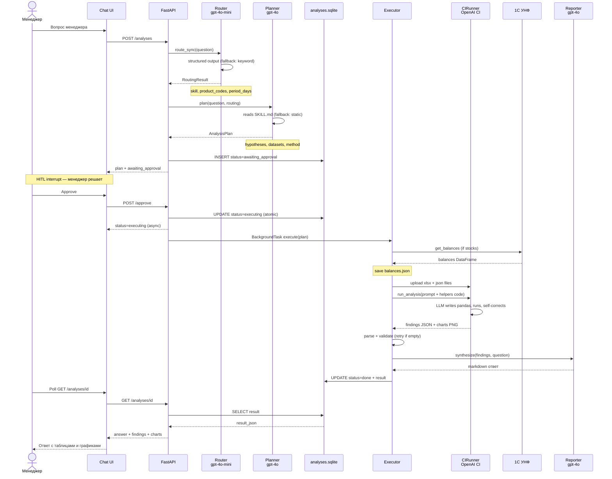
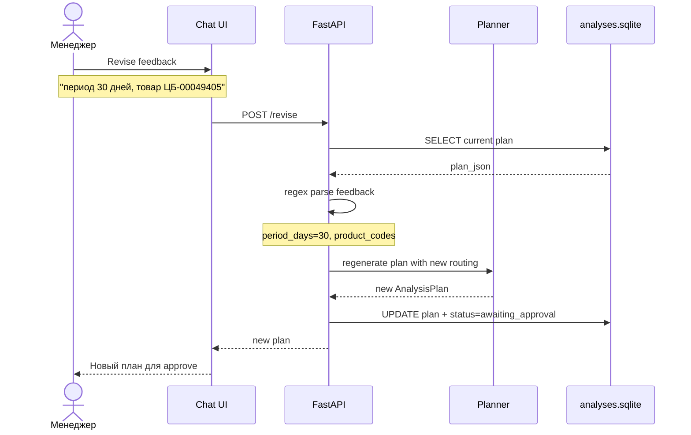
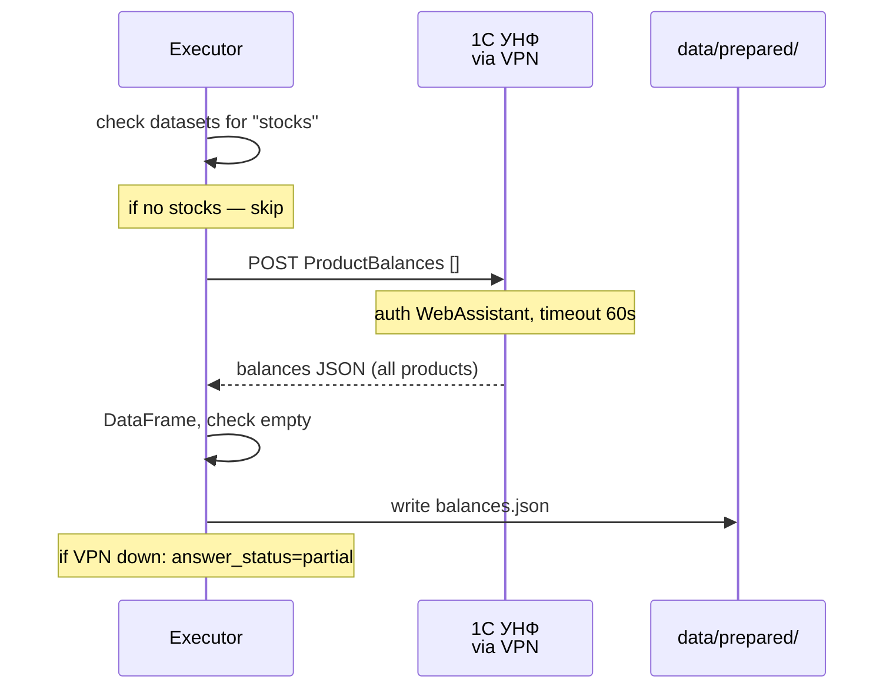

# Mirrolla AI — Архитектура текущего MVP (As-Is)

> **Дата:** 2026-07-21 · **Объект:** построенный MVP (коммит `0c6410b`)
> **Методология:** C4 (4 уровня) + ADR + Data Flow + Sequence (skill `ai-design`)
> **Основа:** ревью реального кода (`agent/`, `api/`, `client/`, `helpers/`, `compose.yaml`, `Dockerfile`)
> **Без To-Be / vision** — это документация того, что уже работает. Vision 12 мес — в `mirrolla_design_2026-07-21.md`.

---

## 1. Контекст и цели

**Бизнес-задача (ТЗ `docs/tz.md`):** менеджер Mirrolla (продажи через WB+Ozon) тратит несколько часов в день на анализ продаж, остатков, отзывов, цен, SEO, динамики спроса. AI-ассистент отвечает на вопросы менеджера и формирует аналитические отчёты на основе данных 1С и маркетплейсов.

**Что построено (MVP):** LangGraph-пайплайн `understand → route → plan → [HITL interrupt] → execute (OpenAI Code Interpreter) → report`. HTTP-API (FastAPI, 7 эндпоинтов), статический HTML-UI, Docker Compose (api + ui). 4 аналитических skill-класса. Интеграция с тестовым API 1С через VPN.

**Quality-атрибуты, под которые оптимизирован MVP:**
1. **Time-to-demo** — всё через OpenAI (без своей инфраструктуры LLM), чтобы показать за 5 дней пилота.
2. **Точность цифр** — Code Interpreter сам пишет и запускает pandas-код, LLM не считает в голове.
3. **Human-in-the-loop** — менеджер видит план до выполнения, может править/отменять.
4. **Resilience к отсутствию LLM/1С** — keyword-fallback в router, статический fallback в planner, template-ответ в reporter.

**Явные non-goals MVP (по коду, не по ТЗ):** многопользовательность, auth/RBAC (только опциональный API-key), история остатков (только snapshot), реальная интеграция WB/Ozon API (только xlsx-выгрузки), scheduled-отчёты (только по кнопке), observability/tracing.

---

## 2. C4 Level 1 — System Context



**Акторы:** 1 менеджер (MVP — без многопользовательности, rate-limit per-IP 10 req/60s).

**Внешние системы:**
- **OpenAI API** — единственный LLM-провайдер. 4 роли: router (`gpt-4o-mini`), planner (`gpt-4o`), executor CI (`gpt-4o-mini`), reporter (`gpt-4o`). Все через одну переменную `token`. Hard dependency — без ключа всё падает в fallback-режим.
- **1С УНФ** — тестовый API за VPN. 3 функции: `ProductInformation` (каталог-дерево, 7+ MB), `ProductBalances` (snapshot остатков), `ProductSales` (продажи за период). Basic auth `WebAssistant:WebAssistant`. Фильтр по кодам не работает — всегда весь список.

**Граница системы:** внутри — FastAPI-процесс (`api/main.py` + `agent/*` + `helpers/*` + `client/*`), статический UI, 2 SQLite-файла, xlsx-выгрузки. Снаружи — OpenAI, 1С, браузер менеджера.

---

## 3. C4 Level 2 — Containers



| Контейнер | Технология | Протокол | Ответственность |
|---|---|---|---|
| **api** | FastAPI 0.139 + uvicorn, Python 3.12-slim (`Dockerfile`) | HTTP :8000 | 7 эндпоинтов, Router→Planner→Executor→Reporter, rate-limit, опц. API-key auth, раздаёт `ui/mirrolla_assistant.html` на `/` |
| **ui** | nginx:alpine (`compose.yaml`) | HTTP :8080 | Статический `mirrolla_assistant.html`, прокси `/api/v1/*` на api. `API_HOST=localhost:8000` env |
| **analyses.sqlite** | SQLite (WAL) | файл | Таблица `analyses`: id, question, skill, status, plan_json, result_json, timestamps |
| **checkpoints.sqlite** | SQLite (WAL) | файл | LangGraph `SqliteSaver` — состояние графа между запусками (thread_id → state) |

**Объём данных:** каталог 1С ~3854 товара, 3 Ozon xlsx за 92 дня, WB отзывы 4132 строки. Балансы pre-fetch в `balances.json`.

**Особенность:** `api` раздаёт UI-страницу на `GET /` через `FileResponse` (`api/main.py:182-190`) — в Docker UI-контейнер отдельный, но локально UI открывается прямо с API-порта.

---

## 4. C4 Level 3 — Components

### 4.1 Контейнер `api` — компоненты



| Компонент | Файл | Интерфейс | Зависимости | Данные |
|---|---|---|---|---|
| HTTP endpoints | `api/main.py` | REST `/api/v1/*` | SQLite, agent.* | analyses table |
| Router | `agent/router.py` | `route_sync(text) → RoutingResult` | OpenAI, schemas | — |
| Planner | `agent/planner.py` | `plan(question, routing) → AnalysisPlan` | OpenAI, SKILL.md, products.json | — |
| Executor | `agent/executor.py` | `execute(plan) → ExecutionResult` | ci_runner, reporter, onec_client, helpers | balances.json, charts/ |
| CI Runner | `agent/ci_runner.py` | `CIRunner.run_analysis(prompt, files) → dict` | OpenAI Responses API | file_ids, charts PNG |
| Reporter | `agent/reporter.py` | `synthesize(question, skill, findings, ...) → str` | OpenAI | — |
| 1С Client | `client/onec_client.py` | `get_products/balances/sales() → DataFrame` | requests, 1С API | — |
| Helpers | `helpers/*.py` | чистые pandas-функции | pandas | — |
| LangGraph | `agent/graph.py` + `nodes.py` | `build_graph(checkpointer)`, `AgentState` | SqliteSaver | checkpoints.sqlite |

### 4.2 Skill-инструкции (data, не код)

4 SKILL.md в `agent/skills/` — читаются Planner'ом и инжектируются Executor'ом в CI prompt:
- `sales-decline-analysis/SKILL.md` — почему упали продажи
- `inventory-planning/SKILL.md` — остатки, план производства
- `portfolio-growth/SKILL.md` — рост/падение, сравнение с категорией
- `reviews-and-pricing/SKILL.md` — отзывы, цены

---

## 5. C4 Level 4 — Code: интерфейсы и модель данных

### 5.1 Pydantic-контракты (`agent/schemas.py`)

```python
class SkillType(str, Enum):
    SALES_DECLINE = "sales-decline-analysis"
    INVENTORY = "inventory-planning"
    PORTFOLIO_GROWTH = "portfolio-growth"
    REVIEWS_PRICING = "reviews-and-pricing"

class RoutingResult(BaseModel):           # выход Router
    skill: SkillType
    product_codes: list[str]               # ЦБ-XXXXXXXX / ФР-XXXXXXXX
    period_days: int = 14                  # 1..365

class PeriodSpec(BaseModel):               # внутри AnalysisPlan
    current_days: int
    comparison: str = "previous_equal_period"

class Hypothesis(BaseModel):              # внутри AnalysisPlan
    id: str                                # H1, H2, ...
    title: str
    datasets: list[str]                    # sales, stocks, reviews_wb, reviews_ozon, categories
    method: str
    helpers: list[str]                     # имена функций из helpers/

class AnalysisPlan(BaseModel):            # выход Planner
    skill: SkillType
    question: str
    product_codes: list[str]
    period: PeriodSpec
    hypotheses: list[Hypothesis]           # 3-5 штук
    limitations: list[str]

class Finding(BaseModel):                 # единица результата Executor
    entity_type: str                       # product | review | category
    entity_id: str                         # product_code или review_id
    name: str
    priority: str = "medium"               # critical | high | medium | low
    reasons: list[str]                     # конкретные причины с цифрами
    metrics: dict                          # рассчитанные показатели
    recommended_action: str = ""

class ExecutionResult(BaseModel):         # финальный результат
    question: str
    skill: SkillType
    answer_status: str = "answered"        # answered | partial | not_enough_data
    findings: list[Finding]
    hypothesis_results: list[HypothesisResult]  # опционально, старый формат
    charts: list[str]                      # пути к PNG
    summary: str                           # markdown-ответ от Reporter
    limitations: list[str]
    code_generated: str | None
    errors: list[str]
```

### 5.2 LangGraph state (`agent/nodes.py`)

```python
class AgentState(TypedDict, total=False):
    thread_id: str
    question: str
    routing: RoutingResult
    plan: AnalysisPlan
    approval: Optional[str]            # "approve" | "revise" | "reject" | None
    revision_feedback: Optional[str]
    result: ExecutionResult
    error: Optional[str]
    status: str                        # planning | awaiting_approval | executing | done | rejected | error
```

### 5.3 1С-клиент (`client/onec_client.py`)

```python
class OneCClient:
    def get_products(self, codes: list[str] | None = None) -> pd.DataFrame
        # дерево → flatten, только isGroup=false; колонки: code, name, gtin, articleOzon, ...
    def get_balances(self, codes: list[str] | None = None) -> pd.DataFrame
        # колонки: product_code, name, balance (текущий snapshot)
    def get_sales(self, date_start: str, date_end: str, codes=None) -> pd.DataFrame
        # date_start/date_end: ГГГГММДД (8 цифр без разделителей!)
        # колонки: product_code, name, quantity
# ⚠️ Фильтр по codes не работает — API всегда отдаёт весь список. Фильтрация на стороне приложения.
```

### 5.4 HTTP API (`api/main.py`)

| Метод | Путь | Назначение | Статус после |
|---|---|---|---|
| POST | `/api/v1/analyses` | `question → Router → Planner → план` | `awaiting_approval` |
| GET | `/api/v1/analyses/{id}` | статус + результат (poll) | текущий |
| POST | `/api/v1/analyses/{id}/approve` | запустить выполнение (BackgroundTask) | `executing` → `done`/`error` |
| POST | `/api/v1/analyses/{id}/revise` | правка плана (period/product_code) → пересборка | `awaiting_approval` |
| POST | `/api/v1/analyses/{id}/reject` | отмена | `rejected` |
| POST | `/api/v1/reports/management` | 4 анализа параллельно → авто-отчёт | `executing` ×4 |
| GET | `/api/v1/health` | healthcheck | — |
| GET | `/` | раздаёт `ui/mirrolla_assistant.html` | — |

---

## 6. ADR — архитектурные решения текущего MVP

### ADR-001: Code Interpreter как единственный путь выполнения

**Статус:** Accepted (в MVP)
**Контекст:** ТЗ просит отвечать на 6 типов вопросов по продажам/остаткам/отзывам. Данных много (xlsx, 1С-каталог 3854 товара), формулы разные. Писать детерминированные функции на каждый вопрос — долго для 5-дневного пилота.
**Решение:** Весь анализ идёт через OpenAI Code Interpreter (Responses API, `tool=code_interpreter`). LLM сама пишет pandas-код, запускает в sandbox, возвращает JSON `findings`. Helpers (`helpers/*.py`) инжектируются как **reference code text** в system prompt (`executor.py:295-308`), НЕ импортируются — sandbox OpenAI не видит локальные модули.
**Альтернативы:** (a) Function Calling с `@tool`-обёртками над helpers — детерминированно, но долго писать обёртки на 6 вопросов за 5 дней; (b) локальный pandas + шаблонные ответы — теряем гибкость естественных вопросов. **Почему CI:** максимум гибкости за минимум кода, self-correction встроен, графики скачиваются автоматически.
**Последствия:** + один путь, + графики, + LLM исправляет свой код. − latency 10-30с на запрос, − $0.10+/запрос, − LLM может ошибиться в цифрах (митигировано семантической валидацией + retry).
**Связи:** ТЗ Задача №1 (6 вопросов), `executor.py`, `ci_runner.py`.

### ADR-002: LangGraph StateGraph + SQLite checkpointer для HITL

**Статус:** Accepted
**Контекст:** Менеджер должен увидеть план до выполнения и может отложить решение. Сессия может жить часами/днями.
**Решение:** LangGraph `StateGraph` с узлами `understand → route → plan → human_approval (interrupt) → execute → report`. `SqliteSaver` на `data/checkpoints.sqlite` (WAL) сохраняет state. Resume через `Command(resume=...)` по `thread_id`.
**Альтернативы:** (a) простая state-машина в памяти — теряем состояние между запусками; (b) хранить state в analyses.sqlite вручную — дублирование логики LangGraph. **Почему LangGraph:** готовый interrupt/resume, визуализация графа, checkpointer из коробки.
**Последствия:** + менеджер может закрыть терминал и вернуться завтра, + граф явный. − два SQLite-файла (analyses + checkpoints), − LangGraph-специфичная сериализация state.
**Связи:** `agent/graph.py`, `agent/nodes.py`, ТЗ (HITL неявно из «помогать принимать решения»).

### ADR-003: 1С — pre-fetch balances на-лету, не scheduled sync

**Статус:** Accepted (в MVP)
**Контекст:** CI sandbox не имеет доступа к VPN/1С. Балансы нужны для inventory-вопросов.
**Решение:** `executor._prefetch_balances()` дёргает `OneCClient.get_balances()` перед каждым CI-анализом, если в гипотезах есть `stocks`. Результат сохраняется в `data/prepared/balances.json` и загружается в CI как файл.
**Альтернативы:** (a) scheduled sync в БД — правильнее, но +инфраструктура (Celery/Redis) сверх 5-дневного пилота; (b) прокинуть 1С в CI sandbox — невозможно, sandbox изолирован. **Почему pre-fetch:** минимальная инфраструктура, работает для пилота.
**Последствия:** + нет доп. сервисов. − VPN single point of failure (если 1С лежит — `answer_status=partial`, limitations), − latency +7MB на каждый stocks-анализ, − нет истории остатков (только snapshot).
**Связи:** `executor.py:92-132`, `client/onec_client.py`, ТЗ Задача №3.

### ADR-004: Helpers как reference code, не как импорт

**Статус:** Accepted
**Контекст:** `helpers/*.py` — проверенные pandas-функции. CI sandbox их не видит.
**Решение:** `_load_helpers_code()` читает исходники `sales.py`, `stocks.py`, `reviews.py` и вставляет текстом в CI prompt как `### helpers/{name}\n```python\n{code}\n````. CI воспроизводит логику, self-corrects.
**Альтернативы:** (a) не давать helpers — CI пишет с нуля, больше ошибок; (b) Function Calling — см. ADR-001 альтернатива. **Почему reference code:** переиспользование проверенной логики без доп. инфраструктуры.
**Последствия:** + CI видит проверенные формулы. − CI может проигнорировать helpers и написать своё, − дублирование (логика и в helpers, и воспроизводится в sandbox).
**Связи:** `executor.py:295-308`, `helpers/`.

### ADR-005: Fallback-цепочка на каждый LLM-шаг

**Статус:** Accepted
**Контекст:** OpenAI может лежать, ключ может отсутствовать (demo без ключа).
**Решение:** Каждый LLM-компонент имеет fallback: Router → keyword-классификация (`router.py:103-135`); Planner → статический план по шаблонам из SKILL.md (`planner.py:212+`); Reporter → template-ответ из findings (`reporter.py:120-157`); Executor → если CI упал, `answer_status=partial` + текст.
**Альтернативы:** (a) жёстко требовать OpenAI — не запустится без ключа; (b) один fallback на весь пайплайн — теряем гранулярность. **Почему на каждый шаг:** каждый компонент независимо работает без LLM, демо не падает целиком.
**Последствия:** + демо работает без ключа (деградировано), + изоляция отказов. − fallback-планы хуже LLM-сгенерированных, − keyword-fallback может ошибиться в skill.
**Связи:** `router.py`, `planner.py`, `reporter.py`, `executor.py`.

### ADR-006: Два SQLite-файла вместо одного

**Статус:** Accepted
**Контекст:** Нужны метаданные анализов (API) и LangGraph state (checkpointer).
**Решение:** `analyses.sqlite` (таблица `analyses`, CRUD из `api/main.py`) + `checkpoints.sqlite` (LangGraph `SqliteSaver`, непрозрачная сериализация). Разные файлы, оба WAL.
**Альтернативы:** (a) один файл, разные таблицы — риск миграций LangGraph ломает метаданные; (b) PostgreSQL — оверкилл для single-user MVP. **Почему два файла:** изоляция, LangGraph не трогает метаданные.
**Последствия:** + простота, no-ops. − два connection, − не масштабируется на команду (single-writer).
**Связи:** `api/main.py:49-50`, `agent/graph.py:61`.

---

## 7. Data Flow Diagrams

### DF-1: Анализ менеджера (основной поток, API-путь)

```
1. [Менеджер] -> question: str -> [UI: mirrolla_assistant.html]
2. [UI] -> POST /api/v1/analyses {question} -> [API: create_analysis]
3. [API] -> question -> [Router: route_sync, gpt-4o-mini + structured output]
4. [Router] -> RoutingResult{skill, product_codes, period_days} -> [API]
5. [API] -> question + routing -> [Planner: plan(), gpt-4o + SKILL.md + structured output]
6. [Planner] -> AnalysisPlan{hypotheses, datasets, method, limitations} -> [API]
7. [API] -> INSERT analyses (id, question, skill, status=awaiting_approval, plan_json) -> [analyses.sqlite]
8. [API] -> AnalysisResponse{plan} -> [UI: показать план менеджеру]
   --- HITL interrupt (менеджер решает) ---
9a. [UI] -> POST /approve -> [API: approve_analysis]
    [API] -> UPDATE status=executing (атомарно WHERE status=awaiting_approval) -> [analyses.sqlite]
    [API] -> BackgroundTask(_execute_analysis_background) -> [Executor: execute(plan)]
9b. [UI] -> POST /revise {feedback} -> [API: revise_analysis]
    [API] -> regex: "период N" → period_days, "ЦБ-XXXXXXXX" → product_codes
    [API] -> generate_plan(question, new routing) -> UPDATE plan_json -> [analyses.sqlite]
9c. [UI] -> POST /reject -> [API] -> UPDATE status=rejected -> END
10. [Executor] -> _prefetch_balances (если stocks в гипотезах) -> [1С УНФ via VPN]
11. [1С] -> balances DataFrame -> [Executor] -> balances.json -> [data/prepared/]
12. [Executor] -> _collect_data_files (xlsx + products.json + balances.json) -> список путей
13. [Executor] -> _build_prompt (SKILL.md + helpers reference code + DATA_SCHEMA + hypotheses) -> prompt str
14. [Executor] -> CIRunner.run_analysis(prompt, file_paths) -> [OpenAI Responses API]
15. [CIRunner] -> upload files (files.create, purpose=user_data) -> [OpenAI]
16. [CIRunner] -> responses.create(tool=code_interpreter, container=auto+file_ids) -> [OpenAI sandbox]
17. [sandbox] -> LLM пишет pandas код, запускает, self-corrects (max 2 retry) -> findings JSON + charts PNG
18. [CIRunner] -> download charts -> [data/charts/] ; extract text -> [Executor]
19. [Executor] -> _parse_ci_result (regex JSON extraction, NaN sanitize) -> findings[], answer_status, answer
20. [Executor] -> validate_analysis_result (list-вопросы: findings не пустой) -> если fail → retry CI
21. [Executor] -> reporter.synthesize(question, skill, findings, ...) -> [Reporter: gpt-4o]
22. [Reporter] -> markdown ответ -> [Executor] -> ExecutionResult{summary, findings, charts, limitations}
23. [API] -> UPDATE status=done, result_json -> [analyses.sqlite]
24. [UI] -> GET /api/v1/analyses/{id} (poll) -> [API] -> result -> [UI: ответ + таблицы + графики]
```

**Трансформации:** question(str) → RoutingResult(structured) → AnalysisPlan(structured) → CI prompt(text+code) → findings(JSON) → markdown(text).
**Побочные эффекты:** INSERT/UPDATE analyses.sqlite (шаги 7, 9a, 23); pre-fetch 1С → balances.json (11); upload files в OpenAI (15); download charts (18).
**Условия ошибки:** OpenAI timeout → fallback (keyword router / статич. plan / template reporter); 1С недоступен → balances не загружены, `answer_status=partial`, limitation; CI не вернул JSON → retry (до 2×), затем answer=текст; findings пустой для list-вопроса → retry с указанием ошибок валидации.

### DF-2: CLI-путь (LangGraph с interrupt/resume)

```
1. [CLI] -> python -m agent "вопрос" -> [graph.main]
2. [graph] -> build_graph(SqliteSaver) -> invoke({question, thread_id=uuid})
3. [graph] -> understand → route → plan -> [interrupt: human_approval_node]
4. [graph] -> SqliteSaver.put (state в checkpoints.sqlite) -> печатает thread_id -> EXIT
   --- менеджер закрывает терминал, возвращается позже ---
5. [CLI] -> python -m agent --resume <thread_id> approve -> [graph.main]
6. [graph] -> SqliteSaver.get_tuple(thread_id) -> восстановление state
7. [graph] -> Command(resume="approve") -> invoke -> execute → report -> END
8. [graph] -> печатает ответ менеджеру
```

### DF-3: Авто-отчёт (fixed workflow, `reports/generator.py` + API)

```
1. [Cron/кнопка] -> POST /api/v1/reports/management -> [API: management_report]
2. [API] -> 4 question (growth, decline, critical_stock, bad_reviews) -> [Router ×4]
3. [API] -> 4 AnalysisPlan -> INSERT analyses status=executing ×4 -> [analyses.sqlite]
4. [API] -> BackgroundTask ×4 -> [Executor ×4 sequentially]
5. [Executor] -> 4 × (CI анализ: pre-fetch + upload + run + parse + reporter) -> 4 × ExecutionResult
6. [API] -> UPDATE status=done ×4 -> [analyses.sqlite]
7. [API/CLI] -> GET /analyses/{id} ×4 poll -> markdown сборка: топ-10 рост, топ-10 падение, остатки, отзывы
```

---

## 8. Sequence Diagrams — критические пути

### SQ-1: HITL-анализ (основной путь с interrupt)



### SQ-2: Revise-цикл (менеджер правит план)



### SQ-3: 1С pre-fetch balances (синхронно в Executor)



---

## 9. Constraints (инварианты и ограничения)

### Технические инварианты (нельзя нарушать)

1. **Один LLM-провайдер** — OpenAI через `token` env. Нет абстракции провайдера, модель захардкожена в env (`ROUTER_MODEL`, `PLANNER_MODEL`, `EXECUTOR_MODEL`, `REPORTER_MODEL`).
2. **Code Interpreter sandbox изолирован** — не имеет доступа к VPN/1С/локальным модулям. Все данные загружаются как файлы через `files.create(purpose=user_data)`.
3. **Helpers — reference code, не импорт** — `helpers/*.py` читаются как текст и инжектируются в CI prompt. Sandbox их не импортирует.
4. **1С-фильтр по кодам не работает** — API всегда отдаёт весь список. Фильтрация на стороне приложения (`onec_client.py:8`).
5. **1С-даты: ГГГГММДД** — 8 цифр без разделителей (`onec_client.py:100`).
6. **Коды товаров: `ЦБ-XXXXXXXX` или `ФР-XXXXXXXX`** — regex `(ЦБ|ФР)-\d{8}`. Важно: ЦБ (буква Б), не ЦР.
7. **Два SQLite-файла** — `analyses.sqlite` (метаданные) и `checkpoints.sqlite` (LangGraph). Не объединять.
8. **Rate limit: 10 req/60s per IP** — in-memory (`api/main.py:99-115`). Не персистентный, сбрасывается при рестарте.
9. **API-key auth опциональна** — если `API_KEY` env пуст, auth отключена (dev mode, `api/main.py:120-123`).
10. **BackgroundTasks, не Celery** — выполнение асинхронное через FastAPI BackgroundTasks (`api/main.py:435-468`). Нет retry/visibility/масштабирования.

### Стабильные интерфейсы (контракты)

- `route_sync(text) → RoutingResult` — точка входа Router для API и CLI.
- `plan(question, routing=None) → AnalysisPlan` — Planner; `routing=None` триггит внутренний вызов Router.
- `execute(plan) → ExecutionResult` — Executor; внутри вызывает Reporter.
- `synthesize(question, skill, findings, limitations, answer_status, ci_answer) → str` — Reporter.
- `OneCClient.get_products/balances/sales() → pd.DataFrame` — 1С-клиент.
- Pydantic-модели в `agent/schemas.py` — контракт между всеми компонентами.

### Данные (что есть, чего нет)

| Датасет | Источник | Период | Ограничение |
|---|---|---|---|
| sales | Ozon xlsx (3 файла) | 17.03-16.06.2026 (92 дня) | только Ozon, нет WB заказов |
| reviews_ozon | внутри Ozon xlsx | 92 дня | ~80% пустой текст отзыва |
| reviews_wb | WB xlsx | 17.03-17.06.2026 | только отзывы, нет заказов |
| categories | 1С products.json (productType) | snapshot | — |
| stocks | 1С balances (pre-fetch) | текущий snapshot | нет истории остатков |
| цены продажи | — | — | **нет данных** |
| цены конкурентов | — | — | **нет данных** |
| SEO карточек | — | — | **нет данных** |

---

## 10. Риски и trade-offs текущего MVP

| Риск | Вероятность | Impact | Митигация в MVP |
|---|---|---|---|
| OpenAI API downtime / нет ключа | Средняя | Высокий | ADR-005 fallback на каждый шаг (keyword router, static plan, template reporter) |
| 1С VPN недоступен | Высокая | Средний | `answer_status=partial` + limitation; balances не загружены, stocks-гипотезы пропущены |
| CI latency 10-30с | Текущее | Средний | BackgroundTasks + poll UI; `RUN_TIMEOUT=300s` |
| LLM галлюцинирует цифры | Средняя | Высокий | CI сам запускает pandas (не считает в голове); семантическая валидация + retry; Reporter работает с findings, не считает |
| CI не вернул валидный JSON | Средняя | Средний | `max_retries=2` self-correction через `previous_response_id`; regex-парсер с 4 паттернами; fallback на текст |
| Нет данных WB заказов | Текущее | Высокий | limitation в плане; WB-вопросы отвечают по отзывам |
| Нет цен продажи/конкурентов | Текущее | Высокий | limitation; вопрос «изменить цену» не отвечаем полно |
| SQLite single-writer | Низкая (1 user) | Средний | WAL mode; для команды — нужен PostgreSQL (vision) |
| Rate-limit in-memory | Низкая | Низкий | сбрасывается при рестарте — приемлемо для single-user MVP |

**Что оптимизировали:** time-to-demo (ADR-001 CI за минимум кода), resilience без LLM (ADR-005), HITL с персистентностью (ADR-002).

**Чем пожертвовали:** cost (CI $0.10+/запрос), latency (10-30с), масштабируемостью (single-user, SQLite), точностью типовых (LLM может ошибиться, нет детерминированного FC-пути).

---

## Verification status

**Дизайн текущего MVP готов к верификации.** Это документация As-Is (что построено), не vision. Vision 12 мес — в `mirrolla_design_2026-07-21.md`, диаграммы — в `mirrolla_diagrams_2026-07-21.md`.

**Чек-лист ai-design (текущая архитектура):**
- [x] C4 L1 (Context) — As-Is
- [x] C4 L2 (Containers) — As-Is
- [x] C4 L3 (Components) — api + agent
- [x] C4 L4 (Code) — Pydantic-контракты + 1С-клиент + HTTP API
- [x] ADR × 6 (CI-путь, LangGraph+HITL, 1С pre-fetch, helpers reference, fallback-цепочка, 2 SQLite)
- [x] Data Flow × 3 (API-анализ, CLI-resume, авто-отчёт)
- [x] Sequence × 3 (HITL, revise, 1С pre-fetch)
- [x] Constraints (10 инвариантов + стабильные интерфейсы + данные)
- [x] Риски + trade-offs (что оптимизировали / пожертвовали)
- [x] Основан на реальном коде, не README/PLAN

---

## Verification (Mermaid render)

Все 6 Mermaid-блоков провалидированы рендером через `mmdc` (`npx --yes @mermaid-js/mermaid-cli`).

```
Block 0: OK  (svg=19174 bytes)   — C4 L1 System Context
Block 1: OK  (svg=20981 bytes)   — C4 L2 Container Diagram
Block 2: OK  (svg=41902 bytes)   — C4 L3 Component Diagram
Block 3: OK  (svg=45946 bytes)   — SQ-1 HITL-анализ (sequence)
Block 4: OK  (svg=29722 bytes)   — SQ-2 Revise-цикл (sequence)
Block 5: OK  (svg=26088 bytes)   — SQ-3 1С pre-fetch (sequence)

=== RESULT: 6/6 OK, 0 FAIL ===
```

Текстовый формат (Mermaid + ASCII), без графических инструментов (pitfall #11 навыка).